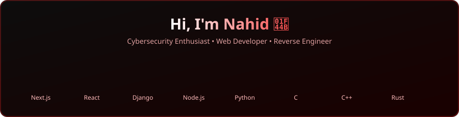

### **Hi I am**

  

  

## **☕ About me**

I'm Nahid, a passionate student who currently focused on Cybersecurity stuff. Other than that, I also interested in Web Development and Open Source stuff. I love to learn new things and always open to new opportunities. My hobbies are playing games (random), watching anime & movies/series, and sometimes tinkering with random stuff like coding & reverse engineering (I love doing this a lot).

## **🛠️ Developer Stack**

  
  
  
  
   
  
  
  
  

## **🧋 Cutie Counter**

	
	  
	<code>People who visit my profile :3</code>

## GitHub Stats ✨
<table>
  <tr>
    <td></td>
    <td></td>
  </tr>
</table>
